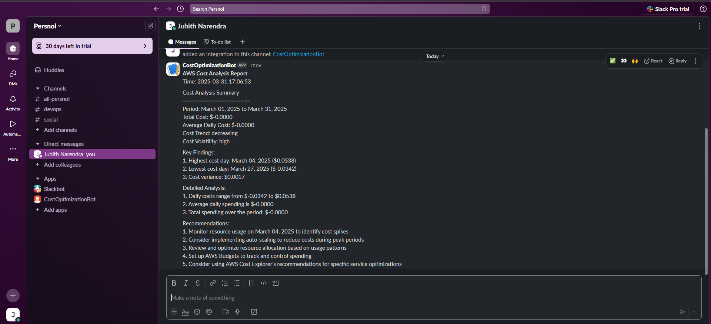

# AWS Cost Analysis and Optimization Tool

This tool performs automated analysis of AWS cost data using rule-based algorithms and statistical calculations to provide optimization recommendations. It fetches cost data from AWS Cost Explorer, analyzes spending patterns, and sends detailed recommendations to both a local file and Slack.

## Features

- Fetches AWS cost data for the last 30 days
- Performs statistical analysis of cost patterns and trends
- Generates data-driven optimization recommendations
- Saves detailed reports to timestamped files
- Sends automated notifications to Slack
- Calculates cost volatility metrics
- Identifies cost anomalies and patterns

## How It Works

The tool uses a rule-based analysis system that:
1. Collects historical cost data from AWS Cost Explorer
2. Performs statistical analysis (averages, trends, variance)
3. Applies predefined optimization rules based on AWS best practices
4. Generates actionable recommendations based on actual usage patterns
5. Formats and delivers insights through multiple channels

## Sample Slack Notification

Here's how the Slack notifications look:



The notification includes:
- Cost Analysis Summary with period details
- Total and average daily costs
- Cost trend analysis
- Cost volatility indicators
- Highest and lowest cost days
- Detailed cost analysis
- Actionable recommendations

## Prerequisites

- Python 3.6 or higher
- AWS credentials configured with Cost Explorer access
- Slack webhook URL (for notifications)
- Required Python packages:
  - boto3
  - requests

## Installation

1. Clone this repository:
```bash
git clone <repository-url>
cd <repository-name>
```

2. Install required packages:
```bash
pip install boto3 requests
```

3. Configure AWS credentials:
   - Ensure you have AWS credentials configured with access to Cost Explorer
   - You can configure credentials using:
     ```bash
     aws configure
     ```
   - Or set environment variables:
     ```bash
     export AWS_ACCESS_KEY_ID='your_access_key'
     export AWS_SECRET_ACCESS_KEY='your_secret_key'
     export AWS_DEFAULT_REGION='your_region'
     ```

4. Set up Slack webhook:
   - Create a Slack app in your workspace
   - Enable Incoming Webhooks
   - Create a webhook URL for your desired channel
   - Set the webhook URL as an environment variable:
     ```bash
     # On Windows PowerShell
     $env:SLACK_WEBHOOK_URL = "your-slack-webhook-url"
     
     # On Linux/Mac
     export SLACK_WEBHOOK_URL="your-slack-webhook-url"
     ```

## Project Structure

- `fetch_data_cost.py`: Fetches cost data from AWS Cost Explorer
- `ai_recommendations.py`: Main script that analyzes costs and generates recommendations
- `slack_alerts.py`: Handles Slack notifications
- `cost_recommendations_*.txt`: Generated recommendation files

## Usage

Run the main script:
```bash
python ai_recommendations.py
```

The script will:
1. Fetch AWS cost data for the last 30 days
2. Display raw cost data for verification
3. Generate and display cost analysis recommendations
4. Save recommendations to a timestamped file
5. Send recommendations to Slack (if configured)

## Output

The tool generates output in three locations:

1. Console Output:
   - Raw cost data for the first 5 days
   - Detailed cost analysis and recommendations
   - Status messages for file saving and Slack notifications

2. Local File Output:
   - Location: Same directory as the script
   - Filename format: `cost_recommendations_YYYYMMDD_HHMMSS.txt`
   - Example: `cost_recommendations_20240331_171500.txt`
   - Contains:
     - Cost Analysis Summary
     - Key Findings
     - Detailed Analysis
     - Recommendations

3. Slack Message (if configured):
   - Channel: #aws-cost-alerts (default, can be configured)
   - Includes:
     - Formatted cost analysis report
     - Timestamp
     - Channel-specific formatting

## Analysis Components

The tool analyzes:
- Total and average daily costs
- Cost trends (increasing/decreasing)
- Cost volatility
- Highest and lowest cost days
- Cost variance

## Recommendations

The tool provides recommendations for:
- Resource usage optimization
- Auto-scaling implementation
- Resource allocation optimization
- Budget tracking
- Service-specific optimizations

## Error Handling

The tool includes error handling for:
- AWS API calls
- File operations
- Slack notifications
- Data validation

## Contributing

1. Fork the repository
2. Create a feature branch
3. Commit your changes
4. Push to the branch
5. Create a Pull Request

## License

This project is licensed under the MIT License - see the LICENSE file for details.

## Support

For support, please open an issue in the repository or contact the maintainers. 